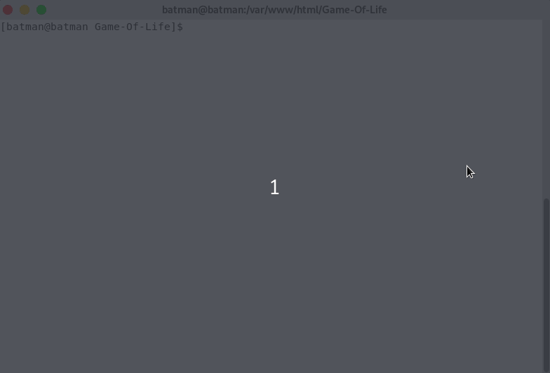

	
	<small>v2.0.228</small>

A complete implementation of Conway's Game of life (and derivative games) in the form of a JS library, web app, and console app.

## JS Library

*@todo*

## Web App

*@todo*

## Console App

 - **Run an RLE file** `./go-life file [color [color [speed [runtime]]]]`
 - **Get info about an RLE file:** `./go-life info file`
 - **List RLE files in the pattern library:** `./go-life ls`

*@todo*

## Change Log

 - [ChangeLog](CHANGELOG.md)

## Credit

*todo* credit pattern file sources

## License

   Copyright 2018 Rob Parham

   Licensed under the Apache License, Version 2.0 (the "License");
   you may not use this file except in compliance with the License.
   You may obtain a copy of the License at

       http://www.apache.org/licenses/LICENSE-2.0

   Unless required by applicable law or agreed to in writing, software
   distributed under the License is distributed on an "AS IS" BASIS,
   WITHOUT WARRANTIES OR CONDITIONS OF ANY KIND, either express or implied.
   See the License for the specific language governing permissions and
   limitations under the License.